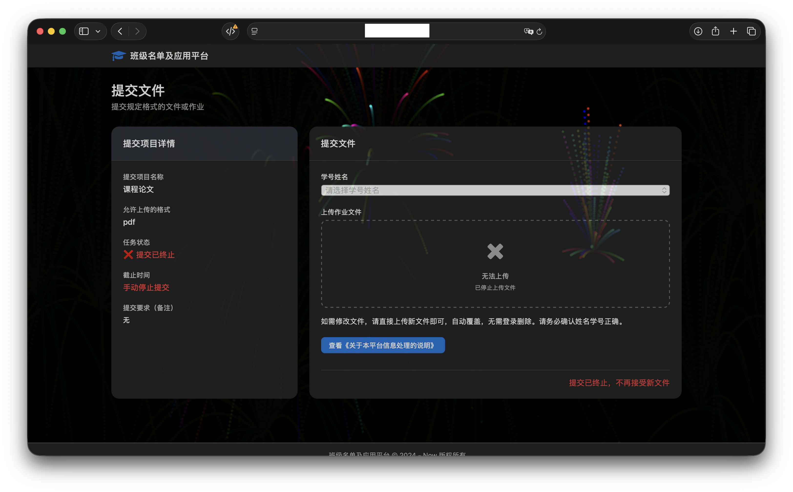
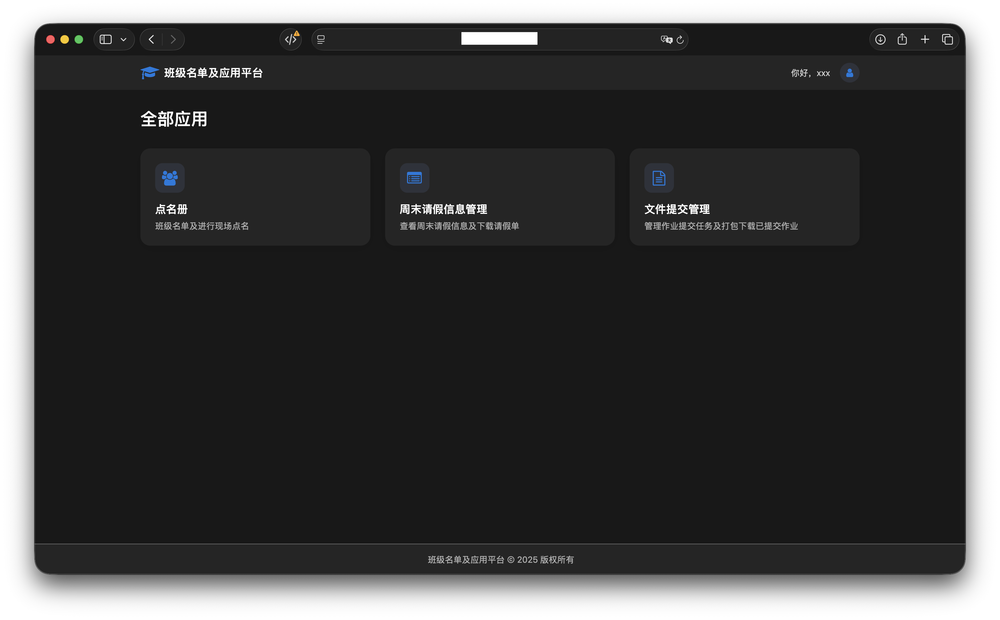

# 班级名单管理及应用平台（PHP）

> [!IMPORTANT]
>
> 该项目PHP版本不再维护，仓库仅用于存档。

> 该项目是用于班里实现收作业、点名、请假的Web平台，基于PHP+mySQL。

项目中还使用了PHPOffice以及jQuery、fontawesome，非常感谢。在使用此项目时请务必严格遵守本仓库及以上项目的Licenses。本项目的代码受到此仓库中的License约束。

项目中引用了我的网站中的部分样式表和Js代码，我在里面都替换了（`staticHost`以及`host`）。基本上这些代码只是用于样式和部分控制样式的，因此你可以自行重写这部分代码。其他本项目中主要功能的JS和CSS没有替换，可放心使用

> [!WARNING]
>
> 最初是快速开发的，因此并不严格遵循代码规范~~（仅保证了能用）~~，并且使用了传统~~（古老）~~的Web技术，还维护成了“ShǐShān”，请见谅。
>
> 项目在开发后一直用于内部。我尽力保证了安全性，但仍然不能保证当中还有部分不可控的漏洞。因此不建议大范围使用。~~不规范的命名和代码规范一定程度上可以防止被黑（开个玩笑别当真，是我菜🤣）~~
>
> 仅仅根据我们班的情况开发的，不具有典型性。
>
> 综上，如果使用过程中出现了问题，开发者我不承担任何责任，请注意！

## 项目历史

1. 最早启动于大一的9月，实现点名册功能、文件作业上传功能
2. 约大一的11月实现了请假单在线填写功能
3. 大一下学期时重构了项目UI，并支持Feishu Bot（飞书部分文档不赘述，若有需要，自行查看代码修改。代码位于lark文件夹内）
4. 大二时此项目PHP版本不再维护，尝试换用新框架重构

> 并非计科相关专业。Just a 多年以上的计算机开发爱好者+班委热心肠

## 部署

### 步骤1：建立数据库

数据库名：platform_of_namelist

若自定义数据库名，请参见步骤2加以修改。

#### 建立数据表

在mySQL中建立如下数据表结构

 

-admin_user

--ID
 --Name
 --UserName
 --Password
 --Note
 --isAdmin
 --lastIP

-file_send

--ID
 --mainName
 --adminUserID
 --hasSendStudentIDs
 --isStop

-namelist

--ID
 --number
 --name
 --dorm
 --gender

 

### 步骤2：配置代码

请前往./src/conj.php，对以下字段加以修改。
 `dbuser` 值为mySQL用户名
 `dbpass` 值为mySQL密码
 `dbname` 值为数据库名称，若按照步骤1建立数据库，则此处为platform_of_namelist

### 步骤2：运行使用

请确保您的服务器安装了PHP，并建议版本在7.0以上。

请使用mySQL插入语句或使用相关图形化软件向相关数据表添加数据，如人员名单。

因本项目用于个人且名单变动不大，故暂未提供图形化快速录入程序。

